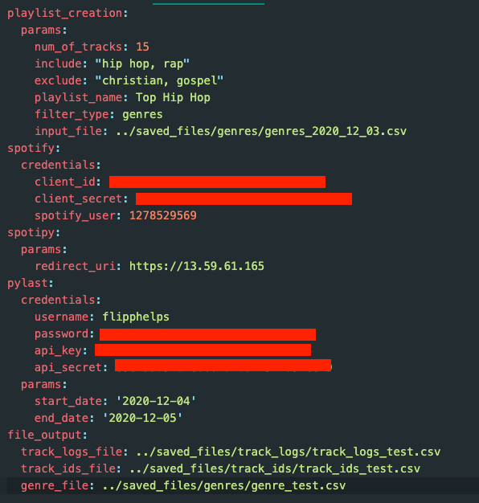
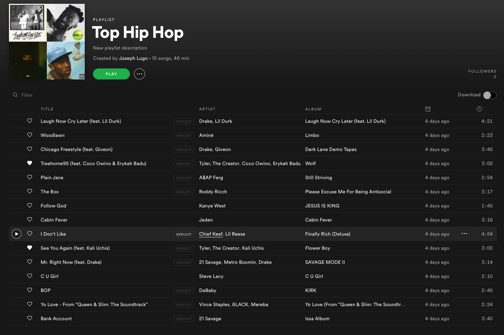

# playlist-creation

## Description
So you know that Spotify Wrapped playlist that you get every year? They mix ALL the genres and artists in one playlist of your top songs. Yeah I never listen to that because I don't want to hear a Gunna track and then Elevation Worship right after. There's a time for both and it's definitely not right after each other. So I made this to get my top tracks and split them up by genre or artist.

## Steps
1. Get the listening history
2. Get the spotify ids for the tracks
3. Get the genres for the tracks
4. Create playlist

### Get the listening history
Using lastfm I was able to track the songs that I listen to on Spotify as Spotify doesn't provide this:
```
python get_track_logs.py common/config.yaml
```

### Get the spotify ids for the tracks
Using the Spotify API I was able to search for the corresponding song ids:
```
python spotify_ids.py common/config.yaml
```

### Get the genres for the tracks
Using the Spotify API again I was able to search for the corresponding genre as well:
```
python genres.py common/config.yaml
```

### Create playlist
Connected to the Spotify API again to create the playlist:
```
python make_playlist.py common/config.yaml
```

#### Example
Setting the config to create a playlist of the top 15 hip hop songs and making sure to filter out any of those christian or gospel hip hop songs haha:



After running `python make_playlist.py common/config.yaml` we can see this in spotify:



#### Coming Soon
Analysis of my listening history including but not restricted to:
- What do you listen to most?
- Is there a pattern for when you listen to certain types of music?
- Distribution of recency of music I listen to (ie. How much of each time period to I listen to?)
- Most skipped song?
- NLP if I'm feeling ambitious
- And more!
